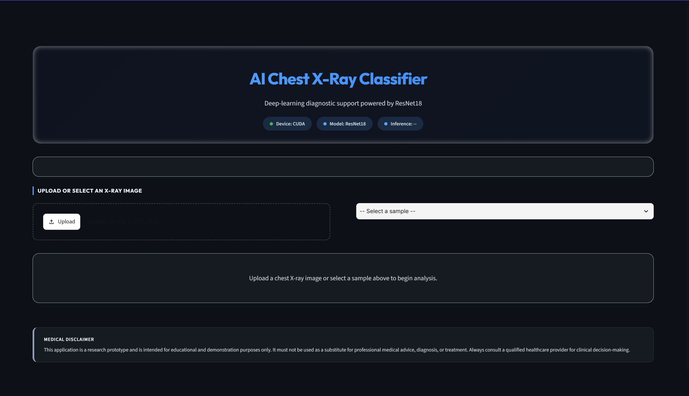
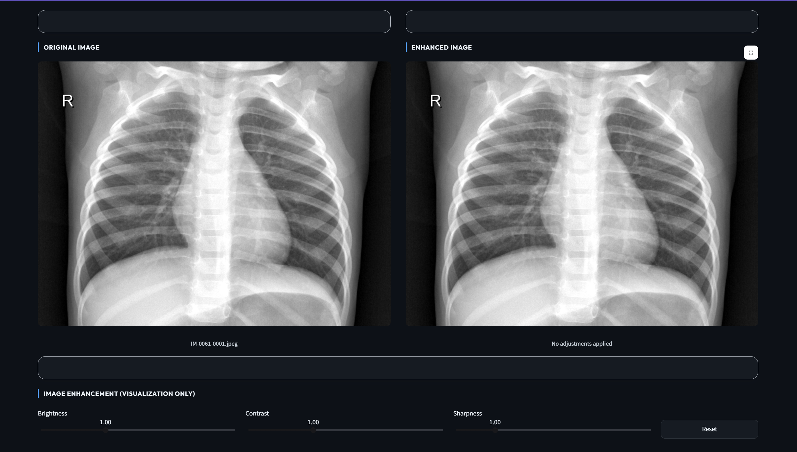
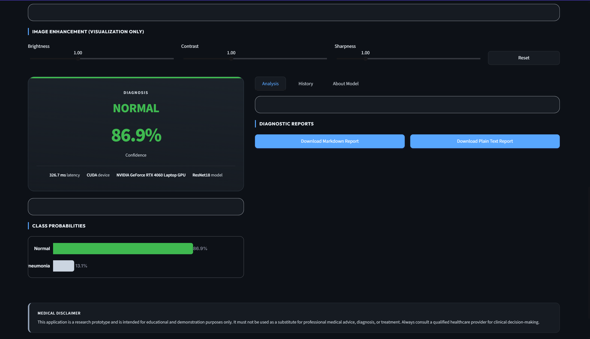
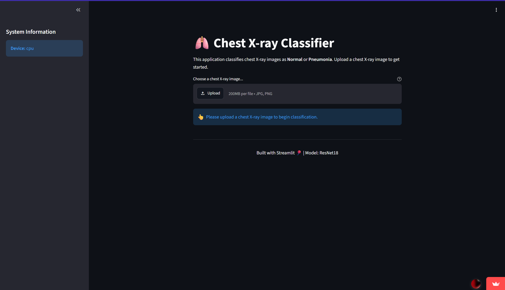

# 🫁 AI Chest X-Ray Pneumonia Classifier

An AI-powered diagnostic support application that classifies chest X-ray images as **Normal** or **Pneumonia** using a fine-tuned **ResNet-18** model built with **PyTorch**. The project includes a modern clinical dashboard developed with **Streamlit** for real-time inference and visualization.

---

## 📌 Project Description

Pneumonia is a serious lung infection that can be identified through chest X-ray imaging. Manual interpretation requires experienced radiologists and can be time-consuming. This project demonstrates how deep learning can assist by automatically classifying chest X-rays into **Normal** or **Pneumonia**, providing fast predictions through an interactive web interface.

> **Disclaimer:** This application is intended for **educational and research purposes only** and must **not** be used for real-world medical diagnosis.

---

## 🚀 Features

- Fine-tuned **ResNet-18** transfer learning model
- Layer-wise fine-tuning (Layer 4 + Fully Connected layer)
- Weighted Cross Entropy Loss for class imbalance
- Tuned pneumonia prediction threshold (0.35) for higher sensitivity
- Premium GitHub Dark themed Streamlit dashboard
- Side-by-side Original and Enhanced X-ray viewer
- Adjustable Brightness, Contrast, and Sharpness controls
- Interactive probability visualization
- Downloadable diagnostic reports (.md / .txt)
- Session history with CSV export
- GPU (CUDA) support

---

## 🛠 Technologies Used

- Python
- PyTorch
- Torchvision
- Streamlit
- Scikit-learn
- NumPy
- Matplotlib
- Pillow (PIL)

---

## 📂 Dataset

This project uses the **Chest X-Ray Images (Pneumonia)** dataset from Kaggle.

Expected directory structure:

```text
chest_xray/
├── train/
│   ├── NORMAL/
│   └── PNEUMONIA/
├── val/
│   ├── NORMAL/
│   └── PNEUMONIA/
└── test/
    ├── NORMAL/
    └── PNEUMONIA/
```

---

## 🧠 Model Architecture

The model uses **Transfer Learning** with a pretrained **ResNet-18**.

### Training Configuration

| Parameter | Value |
|-----------|-------|
| Base Model | ResNet-18 |
| Input Size | 224 × 224 |
| Optimizer | Adam |
| Learning Rate | 1e-4 |
| Loss | Weighted CrossEntropyLoss |
| Batch Size | 64 |
| Epochs | 5 |
| Best Model | `best_model.pth` |

### Fine-Tuning Strategy

- Freeze Layers 1–3
- Unfreeze Layer 4
- Train Final Fully Connected Layer

This approach preserves general ImageNet features while adapting higher-level representations for chest X-ray classification.

---

## 📊 Evaluation

The model is evaluated using:

- Accuracy
- Precision
- Recall
- F1-score
- Confusion Matrix

Instead of the standard 0.5 decision threshold, a **0.35 threshold** is used for Pneumonia predictions to improve recall and reduce false negatives.

---

## 🖥 Streamlit Dashboard

The dashboard provides:

- Upload chest X-ray images
- Original & Enhanced image comparison
- Diagnosis prediction
- Confidence score
- Class probability chart
- Hardware information
- Report generation
- Session history

---

## 📷 Dashboard Preview

### Main Dashboard



### Diagnosis View



### Enhanced Image Analysis



### Previous UI



---

## 📁 Project Structure

```text
ICM/
├── streamlit_app.py
├── model_arch.py
├── inference.py
├── best_model.pth
├── requirements.txt
├── confusion_matrix.png
├── samples/
├── ss/
└── chest_xray/
```
---

## ⚙️ Installation
Clone the repository:

```bash
git clone <repository-url>
cd ICM
```

Create a virtual environment:
### Windows

```powershell
python -m venv venv
.\venv\Scripts\activate
```
### Linux/macOS

```bash
python -m venv venv
source venv/bin/activate
```
Install dependencies:

```bash
pip install -r requirements.txt
```

---
## 🏋️ Training

Download the Kaggle Chest X-Ray dataset and place it inside the project as:

```
chest_xray/
```

Train the model:
```bash
python model_arch.py
```

Training will:

- Fine-tune ResNet-18
- Save the best model as `best_model.pth`
- Generate a confusion matrix
- Print classification metrics

---

## ▶️ Running the Dashboard

Launch the Streamlit application:

```bash
streamlit run streamlit_app.py
```

Then open:

```
http://localhost:8501
```

---

## 🧪 Inference

You can also test the trained model directly:

```bash
python inference.py
```

---

## 📄 License

This project is intended solely for educational and research purposes.
